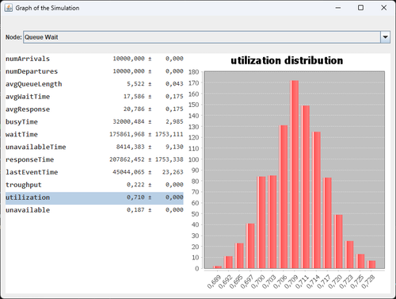
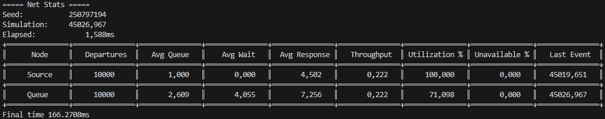
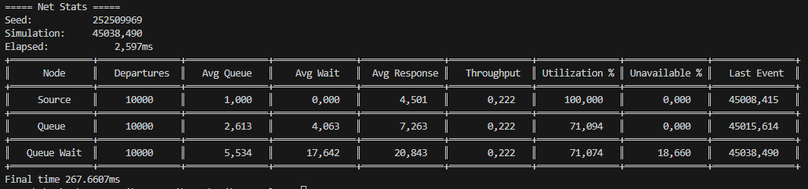
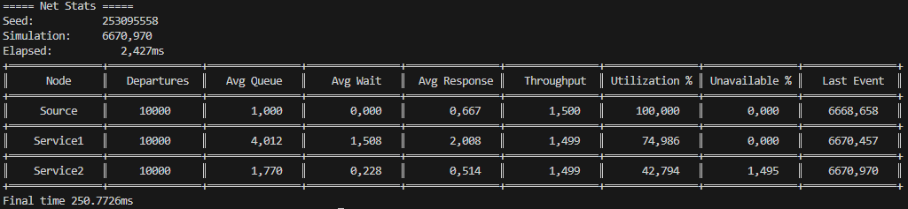

# Valutazione delle Prestazioni

Il progetto riguarda un simulatore ad eventi discreti.
Il simulatore è iniziato con il lavoro trovato sul libro di testo [Discrete-Event System Simulation](https://www.pearson.com/en-us/subject-catalog/p/discrete-event-system-simulation/P200000003161/9780136062127) al Capitolo 4, per poi esser personalizzato e modificato radicalmente.

Il risultato è la creazione in una libreria per la simulazione di eventi discreti nella quale si può scegliera la topologia e la quantità di nodi nella rete da simulare.

Questa libreria è stata confrontata con il tool [JMT](https://jmt.sourceforge.net/Download.html) e le reti usate per fare il confronto si possono trovare sotto [le risorse del main](https://github.com/Berack96/upo-valpre/tree/main/src/main/resources).

> [!IMPORTANT]
> Il JAR risultante che si trova nelle [Releases](https://github.com/Berack96/upo-valpre/releases).\
> La versione di Java usata è la 23 (precisamente la [23.0.1](https://www.oracle.com/java/technologies/javase/jdk23-archive-downloads.html)).

---
### Comandi Jar

Il JAR viene invocato tramite il classico comando java: `java -jar upo-valpre.jar` al quale si aggiungono vari argomenti successivi in base a cosa si vuole fare:

* `java -jar upo-valpre.jar net`\
Usato per avviare una sessione interattiva per la creazione di una rete. Da usare se la rete è relativamente breve da descrivere, altrimenti è più comodo usare il codice della libreria per la generazione della rete.\
Una volta scelta la rete è necessario salvarla in un file per la successiva simulazione e analisi.
* `java -jar upo-valpre.jar simulation -net <file> [other]`\
Usato per avviare una simulazione della rete. Nel caso la rete non abbia eventuali limiti nella generazione di arrivi, viene restituito un errore.
Esistono vari tipi di argomenti per scegliere come fare la simulazione:
  * `-runs <N>` per fare la simulazione N volte
  * `-seed <value>` per dare un seed iniziale scelto
  * `-i <confidences>` per scegliere gli indici di terminazione delle run di simulazione quando l'intervallo di confidenza associato è raggiunto. Viene ignorato il comando -p se questa opzione è attiva. Il formato da usare è\
  **\[nodo:statistica=confidenza:errore%\];\[..\]**
  * `-csv <file>` per salvare i risultati delle run in un file csv
  * `-p` per fare le simulazioni in parallelo (ovvero su più thread)
  * `-end <criteria>` per scegliere quando la simulazione finisce nel caso non ci siano dei source limitati nella creazione di arrivi. La tipologia di fine simulazione la si può trovare dentro `EndCriteria` (ovvero MaxArrivals, MaxDepartures, MaxTime) e la formattazione da usare per passare il parametro è la seguente:\
  **\[tipo:param1,..,paramN\];\[..\]**
* `java -jar upo-valpre.jar plot -csv <file>`\
Mostra (con un ambiente grafico) una finestra nella quale si può scegliere quale nodo vedere e ogni statistica associata ad esso. Di seguito un'immagine di esempio:\

Esistono dei file prefatti per vedere eventuali simulazioni che, nel caso vengano passati come parametri, automaticamente vengono usati:
* `example1.net`, `example2.net` e `example3.net` per `simulation -net`
* `example1.csv`, `example2.csv` e `example3.csv` per `plot -csv`

---
### Classi Interne

Esistono molteplici classi interne che vengono usate per supportare la simulazione e/o mostrare i risultati. In generale le classi dentro il percorso [net.berack.upo.valpre](src/main/java/net/berack/upo/valpre) sono usate per l'utilizzo del jar e quindi non sono essenziali per la simulazione.
I percorsi che invece sono direttamente responsabili per la simulazione sono:
- [net.berack.upo.valpre.rand](src/main/java/net/berack/upo/valpre/rand) All'interno del quale si possono trovare:
  - **Rng** che viene usato per il calcolo di numeri pseudo-casuali tramite un seed iniziale e la generazione di molteplici stream di generazione di numeri casuali
  - **Distribution** interfaccia usata per la generazione di un numero casuale di una distribuzione. In questo file esistono molteplici classi interne che implementano l'interfaccia; per esempio: Exponential, Normal, Uniform
- [net.berack.upo.valpre.sim](src/main/java/net/berack/upo/valpre/sim) Package che contiene tutte le parti utili alla simulazione; per esempio la creazione della rete o la simulazione si più thread:
  - **Net** che viene usato per rappresentare una rete da simulare.
  - **ServerNode** che viene usato per rappresentare un singolo nodo della rete.
  - **Event** che viene usato per rappresentare un evento della simulazione.
  - **EndCriteria** interfaccia che viene implementata dalle classi interne usata per controllare se e quando la simulazione debba finire.
  - **Simulation** e **SimulationMultiple** che vengono usate per far partire la simulazione; la versione multiple serve ad organizzare molteplici simulazioni su più thread o su un singolo core.
- [net.berack.upo.valpre.sim.stats](src/main/java/net/berack/upo/valpre/sim/stats) Package che contiene tutte le classi utili per la raccolta e l'analisi statistica dei vari valori generati dalla simulazione:
  - **Result** il risultato di una run e la sua classe interna **Result.Summary** che contiene molteplici risultati di run già analizzati.
  - **NodeStats** contiene indici statistici di un nodo e la sua classe interna **NodeStats.Summary** che contiene molteplici indici statistici già analizzati.
  - **ConsoleTable** utile per mostrare i risultati in console sottoforma di tabella
  - **CsvResult** utile per la lettura/scrittura dei risultati in formato csv

---
### Esempi

Nel jar sono presenti già 3 reti per fare degli esperimenti e/o testare se il tool funziona correttamente. Per tutti e tre gli esempi i comandi usati sono i seguenti, dove viene sostituito un numero al posto dell'asterisco:
- `java -jar .\upo-valpre.jar simulation -net example*.net -runs 100` per fare una simulazione di 100 run e vedere i risultati aggregati.
- `java -jar .\upo-valpre.jar plot -csv example*.csv` per mostrare un'aggregazione con più dettagli di una simulazione di 1000 run.

##### Primo esempio
\
Il primo è `example1`; è una rete composta da una fonte di clienti (Source) che arrivano con tasso esponenziale (λ=0.222 e quindi media 4.5) e un centro di servizio (Queue) con tasso di servizio distribuito come una normale (μ=3.2, σ=0.6).\
Se si effettua una simulazione con il comando precedente si vedranno i risultati sulla console in questo modo:

Il tool JMT con la stessa rete produce i seguenti risultati che sono molto simili a quelli prodotti dalla libreria:\
Queue Response Time = 7.3022 con un range [7.1456, 7.4589]\
Queue Throughput = 0.2226 con un range [0.2182, 0.2271]\
Queue Utilization = 0.7111 con un range [0.6959, 0.7262]

##### Secondo esempio
\
Il secondo è `example2`; è una rete composta da una fonte di clienti (Source) che arrivano con tasso esponenziale (λ=0.222 e quindi media 4.5), un centro di servizio (Queue) con tasso di servizio distribuito come una normale (μ=3.2, σ=0.6) e un altro centro di servizio (Queue Wait) con tasso di servizio distribuito come una normale (μ=3.2, σ=0.6) e con un tempo di indisponibilità che viene attivato con probabilità 20% e distribuito con una normale (μ=4.2, σ=0.6)\
Se si effettua una simulazione con il comando precedente si vedranno i risultati sulla console in questo modo:

##### Terzo esempio
\
Il terzo è `example3`; è uguale al secondo esempio ma nel quale cambiano i nomi dei nodi e le loro distribuzioni: è una rete composta da una fonte di clienti (Source) che arrivano con tasso esponenziale (λ=1.5 e quindi media 0.666), un centro di servizio (Service1) con tasso di servizio distribuito come una esponenziale (λ=2.0 e quindi media 0.5) e un altro centro di servizio (Service2) con tasso di servizio distribuito come una esponenziale (λ=3.5 e quindi media 0.2857) e con un tempo di indisponibilità che viene attivato con probabilità 10% e distribuito con una eseponenziale (λ=10.0 e quindi media 0.1)\
Se si effettua una simulazione con il comando precedente si vedranno i risultati sulla console in questo modo:

Il tool JMT con la stessa rete produce i seguenti risultati che sono molto simili a quelli prodotti dalla libreria:\
Service1 Response Time ~ 1.9866\
Busy2 Response Time ~ 0.2825\
Queue2 Response Time ~ 0.2279\
Service1 Utilization ~ 0.7488\
Calibration Number of Customers ~ 0.0150\
Busy2 Number of Customers ~ 0.4279\
Throughput ~ 1.5000

