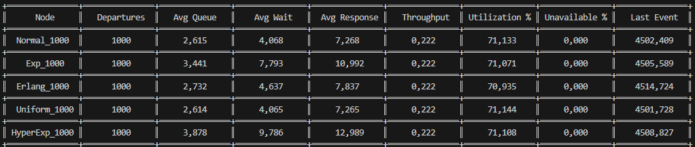

# Valutazione delle Prestazioni

Questo progetto consiste in un simulatore ad eventi discreti. Il simulatore è stato inizialmente sviluppato seguendo il materiale del libro [Discrete-Event System Simulation](https://www.pearson.com/en-us/subject-catalog/p/discrete-event-system-simulation/P200000003161/9780136062127) (Capitolo 4), per poi essere personalizzato e profondamente modificato.

Il risultato finale è una libreria per la simulazione di eventi discreti, che consente di configurare la topologia e il numero di nodi della rete da simulare.

> [!IMPORTANT]
> Il file JAR generato è disponibile nella sezione [Releases](https://github.com/Berack96/upo-valpre/releases).\
> La libreria è stata sviluppata utilizzando Java 23, versione [23.0.1](https://www.oracle.com/java/technologies/javase/jdk23-archive-downloads.html).

## Comandi Jar

Il file JAR può essere eseguito tramite il comando standard `java -jar upo-valpre.jar`, seguito da specifici argomenti in base all'operazione desiderata:

* `java -jar upo-valpre.jar interactive`\
Avvia una sessione interattiva per creare una rete. Questa modalità è consigliata per reti di dimensioni ridotte; per reti più complesse, è preferibile utilizzare il codice della libreria per generare la rete.\
Una volta configurata la rete, è necessario salvarla in un file per eseguire simulazioni e analisi successive.

* `java -jar upo-valpre.jar simulation -net <file> [other]`\
Esegue una simulazione della rete specificata. Se la rete non include limiti per la generazione degli arrivi, verrà restituito un errore. Gli argomenti disponibili per personalizzare la simulazione includono:
  * `-runs <N>`: Esegue la simulazione N volte.
  * `-seed <value>`: Imposta un seed iniziale per la generazione casuale.
  * `-i <confidences>`: Specifica gli indici di terminazione delle simulazioni basati sugli intervalli di confidenza. Ignora l'opzione `-p` se attiva. Formato:\
  **\[nodo:statistica=confidenza:errore%\];\[..\]**
  * `-csv <file>`: Salva i risultati delle simulazioni in un file CSV.
  * `-p`: Esegue simulazioni in parallelo (su più thread).
  * `-end <criteria>`: Definisce i criteri di terminazione della simulazione per reti senza limiti di arrivi. I criteri disponibili sono definiti in `EndCriteria` (MaxArrivals, MaxDepartures, MaxTime). Formato:\
  **\[tipo:param1,..,paramN\];\[..\]**

* `java -jar upo-valpre.jar plot -csv <file>`\
Avvia un'interfaccia grafica per visualizzare i risultati. È possibile selezionare un nodo e analizzare le statistiche associate. Esempio di visualizzazione:\

## Classi Interne

Il progetto include diverse classi interne per supportare la simulazione e la visualizzazione dei risultati. Le classi nel package [net.berack.upo.valpre](src/main/java/net/berack/upo/valpre) sono principalmente utili per l'uso del JAR e non sono essenziali per la simulazione. Le classi principali per la simulazione si trovano nei seguenti package:

- [net.berack.upo.valpre.rand](src/main/java/net/berack/upo/valpre/rand): Contiene:
  - **Rng**: Generatore di numeri pseudo-casuali con supporto per stream multipli.
  - **Distribution**: Interfaccia per la generazione di numeri casuali secondo diverse distribuzioni (es. Exponential, Normal, Uniform).

- [net.berack.upo.valpre.sim](src/main/java/net/berack/upo/valpre/sim): Include:
  - **Net**: Rappresenta una rete da simulare.
  - **ServerNode**: Modella un singolo nodo della rete.
  - **Event**: Rappresenta un evento della simulazione.
  - **EndCriteria**: Interfaccia per definire i criteri di terminazione della simulazione.
  - **Simulation** e **SimulationMultiple**: Avviano la simulazione; la seconda consente l'esecuzione su più thread.

- [net.berack.upo.valpre.sim.stats](src/main/java/net/berack/upo/valpre/sim/stats): Contiene classi per l'analisi statistica:
  - **Result**: Rappresenta i risultati di una simulazione.
  - **NodeStats**: Contiene statistiche relative ai nodi.
  - **ConsoleTable**: Mostra i risultati in formato tabellare.
  - **CsvResult**: Gestisce la lettura/scrittura dei risultati in formato CSV.

## Esempi

Il JAR include due reti di esempio utili per esperimenti o per verificare il corretto funzionamento del tool. Per eseguire una simulazione con questi esempi, avviare il tool in modalità interattiva e caricare gli esempi:\
`java -jar upo-valpre.jar interactive`

Oltre ad una verifica semplice che il tool funzioni, sono stati condotti ulteriori esperimenti sulle due reti di esempio, modificando progressivamente il numero di clienti nel sistema e variando la distribuzione di servizio di un nodo, mantenendo invariata la media (μ). Ogni esperimento è stato eseguito con un campione di 1000 simulazioni. I risultati dettagliati sono disponibili a questo [link](https://docs.google.com/spreadsheets/d/1yM1fvlpc2mIIpRe8M7_ry8m3DC3ZxNA204mM60O2hoQ/edit?usp=sharing) nei fogli colorati di verde (net1_incremental, net2_incremental, pivot1, pivot2).\
Le distribuzioni usate hanno tutte la stessa media μ e sono state create con questi parametri:
- Normale(μ, 0.6)
- Uniforme(μ - (μ\*0.1), μ + (μ\*0.1))
- Esponenziale(1/μ)
- Erlang(5, 5/μ)
- Iperesponenziale(p=\[0.5, 0.5\], e=\[1/(μ\*0.5), 1/(μ\*1.5)\])

---

### Primo esempio
\
`example1` è una rete con una fonte di clienti (Source) che arrivano con tasso esponenziale (λ=0.222, media 4.5) e un centro di servizio (Queue) con tasso di servizio distribuito come una normale (μ=3.2, σ=0.6).\
Esempio di risultati in console:\

Risultati grafici con incertezza:\

Modificando la distribuzione di servizio del nodo "Queue", si osservano variazioni nei valori medi della coda, del tempo di attesa e del tempo di risposta, mentre l'utilizzo e il throughput rimangono invariati.\

Di seguito si può vedere il cambiamento del tempo medio di attesa, il numero medio della coda e l'utilizzazione al variare del numero di clienti nel sistema.\

---

### Secondo esempio
\
`example2` è una rete con una fonte di clienti (Source) che arrivano con tasso esponenziale (λ=1.5, media 0.666), un centro di servizio (Service1) con tasso esponenziale (λ=2.0, media 0.5) e un altro centro di servizio (Service2) con tasso esponenziale (λ=3.5, media 0.2857) e un tempo di indisponibilità distribuito esponenzialmente (λ=10.0, media 0.1) con probabilità 10%.\
Esempio di risultati in console:\

Risultati grafici con incertezza:\

Anche in questo caso, modificando la distribuzione di servizio del nodo "Service2", si osservano variazioni nei valori medi della coda e del tempo di attesa, mentre l'utilizzo e il throughput rimangono invariati.\

Una particolarità di questa rete è il basso valore atteso per il tempo di servizio. Questo, in concomitanza con il resample in caso di valori negativi, fa si di aumentare la media della Distribuzione Normale. Nei grafici seguenti è stata inclusa la Normale solo nell'ultimo per mostrare la differenza rispetto le altre distribuzioni.\

## Confronto con JMT

Il tool JMT con le stesse reti di base (ovvero senza cambiare la Distribuzione) ottiene risultati simili al simulatore. Le reti usate per fare il confronto si possono trovare dentro la cartella delle [risorse di test](src/test/resources). I risultati ottenuti dal simulatore e da JMT si possono trovare al seguente [link](https://docs.google.com/spreadsheets/d/1yM1fvlpc2mIIpRe8M7_ry8m3DC3ZxNA204mM60O2hoQ/edit?usp=sharing) nei fogli colorati di blu (example1, example2, Riassunto) oppure direttamente dalla seguente tabella:\

Si possono notare due note messe nella tabella che servono ad indicare da dove vengono presi alcuni dati: La response, l'utilization% e l'unavailable% di Service2.\
Infatti essi si possono derivare da alcuni dati presenti dentro il simulatore JMT:
- Response: è il totale dato da Queue2 + Busy2 dato che il primo indica l'attesa della coda, mentre il secondo indica il tempo medio di servizio.
- Utilization%: è il valore preso dal numero medio di customer di Busy2. In questo caso indica proprio quanto la stazione (essendo single server) è occupata.
- Unavailable%: è il valore preso dal numero medio di customer di Calibration. In questo caso indica proprio quanto la stazione (essendo single server) è ferma e non può servire i clienti.

---

Per quanto riguarda il confronto con l'aumentare dei clienti nel sistema, JMT non permette di fermare la simulazione una volta elaborati N clienti, perciò è stata solo modificata la distribuzione e sono stati salvati i dati. Il risultato è la seguente tabella:\

Notare che, le osservazioni precedenti per la rete2, valgono anche in questo caso per il calcolo del tempo di risposta.